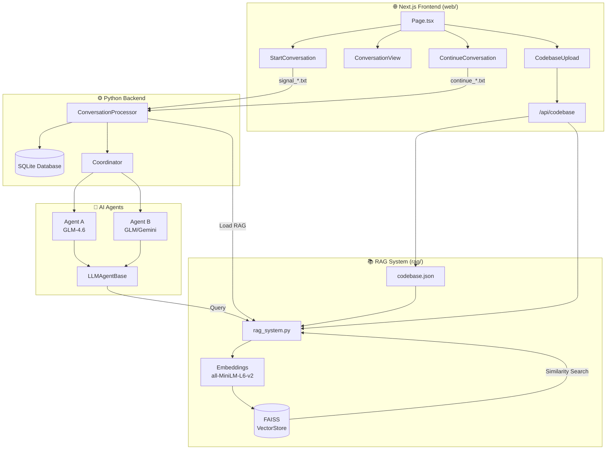
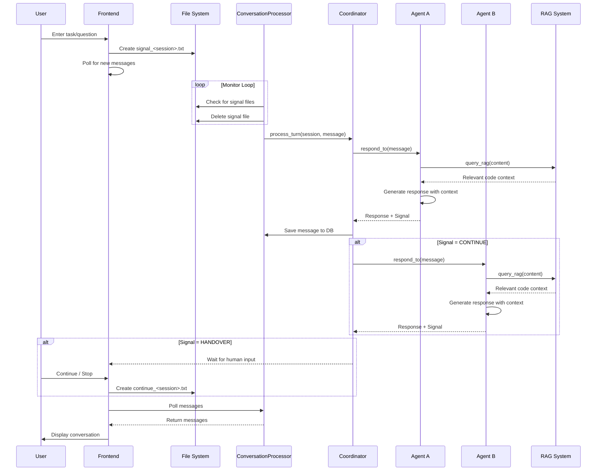
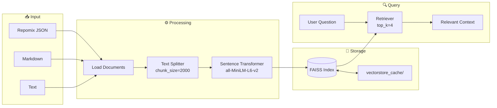
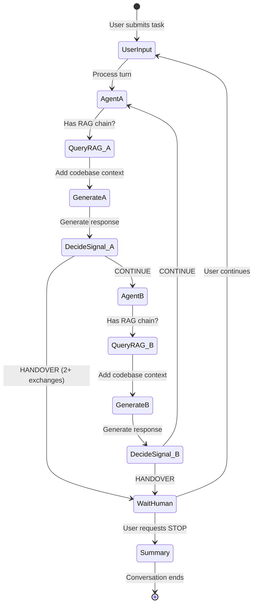

# AI Planning Agents - System Architecture

## System Overview



## Conversation Flow



## RAG Pipeline



## Agent Debate Flow



## File Structure

```
plan-agents/
├── web/                          # Next.js Frontend
│   ├── app/
│   │   ├── page.tsx              # Main planning page
│   │   └── api/codebase/         # Codebase upload API
│   └── components/
│       ├── StartConversation.tsx
│       ├── ConversationView.tsx
│       ├── ContinueConversation.tsx
│       └── CodebaseUpload.tsx
│
├── agents/                       # AI Agents
│   ├── base_agent.py             # Base class with RAG query
│   ├── glm_agent.py              # GLM (z.ai) agent
│   ├── gemini_agent.py           # Google Gemini agent
│   └── shared/
│       ├── llm_agent_base.py     # Shared LLM logic + RAG integration
│       └── prompts.py            # System prompts
│
├── core/                         # Core Infrastructure
│   ├── coordinator.py            # Turn management
│   ├── database.py               # SQLite operations
│   └── message.py                # Message/Signal types
│
├── rag/                          # RAG System
│   ├── rag_system.py             # Main RAG logic
│   ├── embeddings.py             # Local embeddings
│   ├── config.py                 # RAG configuration
│   └── codebase.json             # Uploaded codebase (gitignored)
│
├── storage/                      # Runtime Data
│   ├── signal_*.txt              # New conversation signals
│   ├── continue_*.txt            # Continue conversation signals
│   └── conversations.db          # SQLite database
│
├── conversation_processor.py     # Main backend process
├── .env                          # Configuration
└── requirements.txt              # Python dependencies
```

## Key Components

| Component | Purpose |
|-----------|---------|
| **ConversationProcessor** | Main loop monitoring signals, manages agents and RAG |
| **Coordinator** | Orchestrates turn-taking between agents |
| **LLMAgentBase** | Shared logic for all LLM agents, includes RAG query |
| **RAG System** | Retrieves relevant code context from uploaded codebase |
| **FAISS VectorStore** | Stores embeddings for similarity search |
| **Signal Files** | IPC mechanism between frontend and backend |
