# AI Planning Agents - System Architecture

## System Overview

```mermaid
flowchart TB
    subgraph Frontend["🌐 Next.js Frontend (web/)"]
        UI[Page.tsx]
        SC[StartConversation]
        CV[ConversationView]
        CC[ContinueConversation]
        CU[CodebaseUpload]
        API["/api/codebase"]
    end

    subgraph Backend["⚙️ Python Backend"]
        CP[ConversationProcessor]
        DB[(SQLite Database)]
        COORD[Coordinator]
        PW[PlanningWorkflow]
    end

    subgraph Agents["🤖 AI Agents"]
        AA[Agent A<br/>GLM-4.6]
        AB[Agent B<br/>GLM/Gemini]
        BASE[LLMAgentBase]
        PN[PlanningNodes]
    end

    subgraph RAG["📚 RAG System (rag/)"]
        RS[rag_system.py]
        EMB[Embeddings<br/>all-MiniLM-L6-v2]
        VS[(FAISS<br/>VectorStore)]
        CB[codebase.json]
    end

    UI --> SC & CV & CC & CU
    CU --> API
    API --> CB
    API --> RS

    SC -->|"signal_*.txt"| CP
    CC -->|"continue_*.txt"| CP

    CP --> DB
    CP -->|Debate Mode| COORD
    CP -->|Planning Mode| PW

    COORD --> AA & AB
    PW --> PN
    PN --> AA & AB
    AA & AB --> BASE
    BASE -->|Query| RS

    RS --> EMB --> VS
    VS -->|Similarity Search| RS
    CB --> RS
```



## Conversation Flow


## RAG Pipeline


## Agent Debate Flow (Debate Mode)


## Planning Workflow (Planning Mode)


### Planning Node Sequence

| Node | Agent | Description | Signal |
|------|-------|-------------|--------|
| `analyze_codebase` | Agent A | Query RAG, analyze relevant files | CONTINUE |
| `propose_changes` | Agent A | Propose concrete changes with files/functions | CONTINUE |
| `review_and_refine` | Agent B | Review proposal, add improvements | CONTINUE |
| `validate_proposal` | System | Check proposal has file references | HANDOVER (checkpoint) |
| `finalize_plan` | Agent A | Generate final plan document | HANDOVER |
| `completed` | - | Planning finished | - |

### Human Interrupt Handling

- **STOP/dừng**: Generate summary and end planning
- **Modify/sửa**: Go back to relevant node with new input
- **Other input**: Incorporate into current step and continue

## File Structure

```
plan-agents/
├── web/                          # Next.js Frontend
│   ├── app/
│   │   ├── page.tsx              # Main planning page
│   │   └── api/codebase/         # Codebase upload API
│   └── components/
│       ├── StartConversation.tsx
│       ├── ConversationView.tsx
│       ├── ContinueConversation.tsx
│       └── CodebaseUpload.tsx
│
├── agents/                       # AI Agents
│   ├── base_agent.py             # Base class with RAG query
│   ├── glm_agent.py              # GLM (z.ai) agent
│   ├── gemini_agent.py           # Google Gemini agent
│   ├── planning_graph.py         # Turn-based planning workflow
│   ├── planning_nodes.py         # Planning node functions
│   └── shared/
│       ├── llm_agent_base.py     # Shared LLM logic + RAG + Planning System
│       ├── language_detector.py  # Detect Vietnamese/English
│       ├── language_instructions.py # Language-specific prompts
│       ├── hybrid_guidance.py    # Planning mode guidance
│       ├── prompts.py            # System prompts + Dynamic generation
│       ├── task_analyzer.py      # 🆕 Task classification & analysis
│       ├── codebase_intelligence.py # 🆕 Tech stack & pattern detection
│       ├── prompt_generator.py   # 🆕 Context-aware prompt generation
│       └── execution_plan_generator.py # 🆕 Actionable plan creation
│
├── core/                         # Core Infrastructure
│   ├── coordinator.py            # Turn management
│   ├── database.py               # SQLite operations
│   └── message.py                # Message/Signal types
│
├── rag/                          # RAG System
│   ├── rag_system.py             # Main RAG logic
│   ├── embeddings.py             # Local embeddings
│   ├── config.py                 # RAG configuration
│   └── codebase.json             # Uploaded codebase (gitignored)
│
├── storage/                      # Runtime Data
│   ├── signal_*.txt              # New conversation signals
│   ├── continue_*.txt            # Continue conversation signals
│   └── conversations.db          # SQLite database
│
├── conversation_processor.py     # Main backend process
├── test_planning_standalone.py   # 🆕 Planning system tests
├── PLANNING_SYSTEM_GUIDE.md      # 🆕 Planning system user guide
├── IMPLEMENTATION_SUMMARY.md     # 🆕 Planning system technical docs
├── .env                          # Configuration
└── requirements.txt              # Python dependencies
```

## Key Components

| Component | Purpose |
|-----------|---------|
| **ConversationProcessor** | Main loop monitoring signals, routes to Planning or Debate mode |
| **Coordinator** | Orchestrates turn-taking between agents (Debate mode) |
| **TurnBasedPlanningWorkflow** | Graph-based workflow for structured planning (Planning mode) |
| **PlanningNodes** | Node functions: analyze, propose, review, validate, finalize |
| **LLMAgentBase** | Shared logic for all LLM agents, includes RAG query + Planning System |
| **RAG System** | Retrieves relevant code context from uploaded codebase |
| **FAISS VectorStore** | Stores embeddings for similarity search |
| **Signal Files** | IPC mechanism between frontend and backend |
| **🆕 TaskAnalyzer** | Classifies tasks (feature/refactor/debug), estimates complexity |
| **🆕 CodebaseIntelligence** | Detects tech stack, patterns, analyzes file structure |
| **🆕 PromptGenerator** | Generates context-aware, dynamic prompts for agents |
| **🆕 ExecutionPlanGenerator** | Converts planning conversations into actionable steps |

## Conversation Modes

| Mode | Description | Flow |
|------|-------------|------|
| **Planning** | Structured workflow with checkpoints | Auto-continues through nodes, stops at validation checkpoint |
| **Debate** | Free-form agent discussion | Agents take turns, human can interrupt anytime |

## Flexible Planning System (🆕)

The system now includes an intelligent planning layer that makes agents context-aware, similar to Cursor Plan or Claude Code.

### Planning System Pipeline

```mermaid
flowchart TB
    subgraph Input["📥 User Request"]
        REQ[User Task/Question]
    end

    subgraph Analysis["1️⃣ Task Analysis"]
        TA[TaskAnalyzer]
        TYPE[Classify Type:<br/>feature/refactor/debug/etc.]
        COMP[Estimate Complexity:<br/>simple/moderate/complex]
        LANG[Detect Language:<br/>EN/VI]
    end

    subgraph Intelligence["2️⃣ Codebase Intelligence"]
        CI[CodebaseIntelligence]
        TECH[Detect Tech Stack:<br/>React, Python, etc.]
        PATT[Find Patterns:<br/>MVC, RAG, etc.]
        FILES[Related Files]
    end

    subgraph Prompts["3️⃣ Dynamic Prompts"]
        PG[PromptGenerator]
        CTX[Inject Codebase Context]
        TASK[Task-Specific Guidance]
        DYNAM[Context-Aware Prompt]
    end

    subgraph Response["4️⃣ Agent Response"]
        AGENT[LLM Agent]
        RESP[Intelligent Response]
    end

    subgraph Plan["5️⃣ Execution Plan"]
        EPG[ExecutionPlanGenerator]
        STEPS[Action Steps]
        TESTS[Testing Strategy]
        MARKDOWN[Markdown Plan]
    end

    REQ --> TA
    TA --> TYPE & COMP & LANG
    TYPE & COMP & LANG --> CI

    CI --> TECH & PATT & FILES
    TECH & PATT & FILES --> PG

    PG --> CTX & TASK
    CTX & TASK --> DYNAM
    DYNAM --> AGENT
    AGENT --> RESP

    RESP --> EPG
    EPG --> STEPS & TESTS
    STEPS & TESTS --> MARKDOWN
```



### Planning System Components

#### 1. **Task Analyzer** (`task_analyzer.py`)
- **Purpose**: Understand what the user wants to do
- **Capabilities**:
  - Classifies task types: `feature`, `refactor`, `debug`, `architecture`, `optimization`, `testing`
  - Extracts entities: files, functions, components, APIs, databases
  - Detects language: English or Vietnamese
  - Estimates complexity: `simple`, `moderate`, `complex`
- **Example Output**:
  ```python
  TaskContext(
      task_type=TaskType.FEATURE,
      complexity=ComplexityLevel.MODERATE,
      language="english",
      keywords=["authentication", "nextauth", "oauth"],
      entities={"files": ["auth/route.ts"], "functions": ["login"]}
  )
  ```

#### 2. **Codebase Intelligence** (`codebase_intelligence.py`)
- **Purpose**: Understand codebase structure and patterns
- **Capabilities**:
  - Tech stack detection: React, Next.js, Python, FastAPI, SQLite, etc.
  - Pattern recognition: MVC, microservices, component-based, RAG
  - File analysis: Groups files by type and purpose
  - Dependency tracking: Identifies libraries and usage
- **Example Output**:
  ```python
  CodebaseStructure(
      tech_stack=TechStack(
          languages=["typescript", "python"],
          frameworks=["nextjs", "react", "fastapi"],
          patterns=["component-based", "rag"]
      ),
      related_files=["web/app/page.tsx", "agents/base_agent.py"]
  )
  ```

#### 3. **Dynamic Prompt Generator** (`prompt_generator.py`)
- **Purpose**: Generate intelligent, context-aware prompts
- **Capabilities**:
  - Task-specific guidance: Different for features vs refactors vs debugging
  - Codebase integration: References actual files and tech stack
  - Complexity-adjusted: Simple tasks get concise prompts, complex get detailed
  - Agent-specific: Agent A proposes, Agent B critiques
- **Example**:
  - Static Prompt: "You are Agent A. Provide a solution."
  - Dynamic Prompt: "You are Agent A. **Tech Stack**: Next.js, React. **Task**: Feature (moderate). **Files**: `web/app/page.tsx`. Based on existing component patterns, suggest..."

#### 4. **Execution Plan Generator** (`execution_plan_generator.py`)
- **Purpose**: Convert planning discussions into actionable steps
- **Capabilities**:
  - Decision extraction: Identifies key agreements from conversation
  - Step generation: Creates ordered, dependency-aware action items
  - File tracking: Lists all files that need changes
  - Testing strategy: Suggests appropriate testing approach
  - Complexity estimation: Estimates time/effort required
- **Output Format**: Markdown with sections for Summary, Decisions, Steps, Files, Testing, Risks

### How It Works

1. **On First Human Message**:
   - System analyzes task → `TaskContext`
   - Initializes `CodebaseIntelligence` if RAG available

2. **On Each Agent Response**:
   - Query codebase intelligence for task-specific context
   - Generate dynamic prompt based on task type + codebase
   - Agent receives context-aware system prompt
   - Response includes references to actual files/patterns

3. **After Planning Discussion**:
   - Extract decisions from conversation
   - Generate execution plan with file-level steps
   - Export as markdown for implementation

### Configuration

```python
# Enable (default)
agent = LLMAgentBase(
    role=Role.AGENT_A,
    db=database,
    config={'use_dynamic_prompts': True}
)

# Disable (use static prompts)
agent = LLMAgentBase(
    role=Role.AGENT_A,
    db=database,
    config={'use_dynamic_prompts': False}
)
```

### Benefits

- ✅ **Context-Aware**: Agents understand your codebase structure
- ✅ **Task-Specific**: Different planning depth for different task types
- ✅ **File-Level**: References actual files and patterns
- ✅ **Actionable**: Generates executable plans with steps
- ✅ **Multi-Language**: Supports English & Vietnamese
- ✅ **Backward Compatible**: Can be toggled on/off

### Documentation

- **User Guide**: See `PLANNING_SYSTEM_GUIDE.md` for detailed usage
- **Technical Docs**: See `IMPLEMENTATION_SUMMARY.md` for architecture
- **Testing**: Run `python test_planning_standalone.py` to verify

---

## Database Schema

### Tables

- **sessions**: Conversation sessions with mode (planning/debate)
- **messages**: All messages from agents and humans
- **planning_state**: Persisted state for planning workflow (current_node, analysis, proposal, review, etc.)
